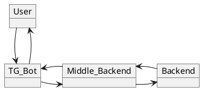

# GPB Academy: Telegram Bot с банковским микросервисом
## О проекте
Телеграм бот выступает в качестве интерфейса
пользователя. Через него осущствляется 
взаимодействие с микросервисом, написанным на Kotlin.
Сам микросервис взаимодействует с банковскими
сервисом.




## Быстрый старт
1. клонирование репозитория  
```git clone gi@github******``` 
2. развертывание проекта  
```*** it`s a magic ***```

## Пример использования сервиса
Здесь будут примеры использования, скриншоты и тд.

## Обо мне
  
Привет, меня зовут Лёша, мне 25 лет и я инежнер, программист и стендапкомик.
Около года работал в Сбере: автоматизировал бизнес процессы на ```Python```.  
```Java``` и ```Kotlin``` для меня абсолютно новые языки. Очень интересно узнавать новые
подходы в программировании, надеюсь на вашу поддержку и помощь 🙂.  
Если у вас остались вопросы, пожелания или даже предложения о работе😅 буду 
рад пообщаться в телеграме. 

@aablagait
